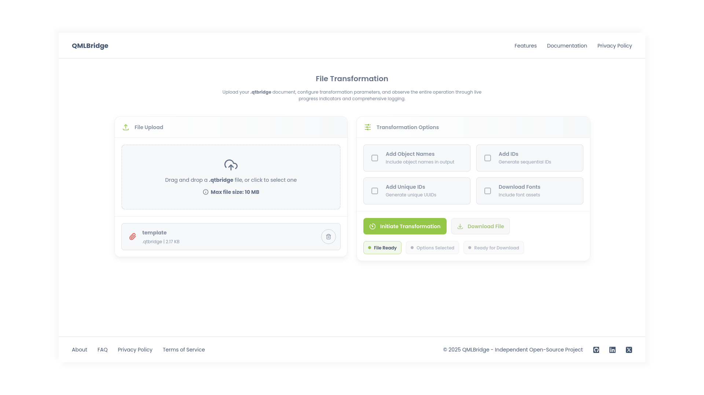

# QMLBridge


[](https://aniket-pise.github.io/QMLBridge)

QMLBridge is a web-based tool that converts `.qtbridge` files into production-ready QML code. It provides a streamlined workflow for transforming design artifacts into clean, functional QML components with automated asset handling.

## Preview



## Table of Contents

- [Features](#features)
- [Using the Application](#using-the-application)
- [Developer Setup](#developer-setup)
- [Environment Configuration](#environment-configuration)
- [License](#license)
- [Contributing](#contributing)
  - [How to Contribute](#how-to-contribute)
  - [Contribution Guidelines](#contribution-guidelines)
  - [Reporting Issues](#reporting-issues)
- [Acknowledgements](#acknowledgements)

## Features

   - **File Transformation:** Turn `.qtbridge` files into clean QML code.  
   - **Custom Output:** Object names, IDs, and automatic font download.  
   - **Asset Management:** Images and fonts processed and bundled automatically.  
   - **Live Feedback:** Real-time progress and detailed logs.  
   - **Export Package:** Download a ZIP with QML files and assets.  
   - **Responsive UI:** Clean interface for desktop and mobile.

## Using the Application

To get started with **[QMLBridge](https://aniket-pise.github.io/QMLBridge)**, follow the steps below to upload a `.qtbridge` file and transform it into QML code.

   1. **Upload a File**
      - Drag and drop a `.qtbridge` file into the upload area.
      - Or, click to browse and select a file from your system.
   
   2. **Configure the Transformation**
      - Enable object names.
      - Choose an ID generation method.
      - **Enable font downloading** if your design uses custom fonts.
   
   3. **Transform and Download**
      - Click **Initiate Transformation** to start the process.
      - Track progress in the live log panel.
      - **Download** the ZIP archive containing all generated files.

## Developer Setup

Follow these steps to set up and run QMLBridge on your local machine.

   1. **Run the Project Locally**  
   
      Follow the steps below to run the project locally for development or customization.

      ```bash
      # Clone the repository and navigate into the project directory
      git clone https://github.com/aniket-pise/QMLBridge.git && cd QMLBridge

      # Install project dependencies
      npm install

      # Start the development server
      npm run dev
      ```
      
      > **Note:** Ensure you are using Node.js version 22.21.x or higher.
   
   2. **Access the Development Server**
   
      Once the server is running, the application will be available at:

      ```text
      http://localhost:5173
      ```

      > **Note:** The port number may vary if `5173` is already in use on your system.

## Environment Configuration

Font downloading requires a Google Fonts API key. To enable this feature, create a `.env` file in the root directory of the project and add your API key as shown below.

```env
VITE_GOOGLE_FONTS_API_KEY=your_api_key_here
```

## License

QMLBridge is licensed under the MIT License.

You are free to use, modify, and distribute this software for both commercial and non-commercial purposes, provided that the original copyright notice and permission notice are included in all copies or substantial portions of the software.

See the [LICENSE](LICENSE) file for the full license text.

## Contributing

Contributions are welcome! Whether it’s reporting bugs, improving documentation, or adding new features — your help is appreciated.

### How to Contribute

   1. **Fork** the repository on GitHub  
   2. **Create** a new branch for your feature or fix  
   
      ```bash
      git checkout -b feature/your-feature-name
      ```
   
   3. **Commit** your changes with clear messages
   
      ```bash
      git commit -m "Add feature: improve format conversion"
      ```
   
   4. **Push** to your fork and open a **Pull Request**

### Contribution Guidelines

   - Follow the project’s style guidelines
   - Ensure the project builds successfully and all tests pass
   - Update documentation where applicable

### Reporting Issues

If you find a bug or have a suggestion, please open an [issue](https://github.com/aniket-pise/QMLBridge/issues) on GitHub and include:

   - A clear description of the issue
   - Steps to reproduce (if applicable)
   - Expected vs actual behavior

## Acknowledgements

This project is built using several excellent open-source tools and libraries. Special thanks to the maintainers and contributors of the following technologies:

   - **React:** Frontend UI framework used for building the interactive web interface.
   - **Vite:** A build tool that enhances development speed with fast hot-reload and build processes.
   - **JSZip:** Library used for generating downloadable ZIP archives of the processed files.

Thanks to the open-source community for providing the tools and inspiration that made this project possible.
