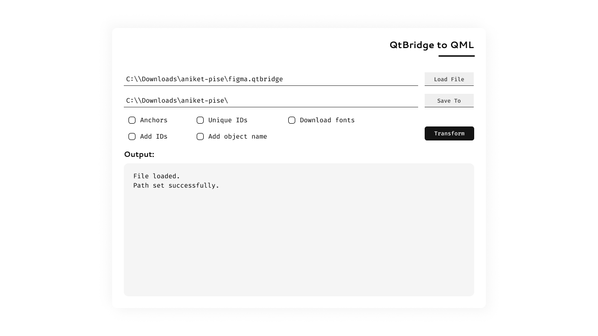

# QMLBridge: Figma (.qtbridge or .metadata) to QML Converter

[](https://github.com/aniket-pise/QMLBridge)

QMLBridge is a tool designed to seamlessly convert Figma `.qtbridge` or `.metadata` files into QML code or components. It resolves common issues users encounter during the conversion process in Qt Design Studio.

## Features

- **File Conversion:** Easily convert Figma `.qtbridge` or `.metadata` files to QML code or components.
- **Customization Options:** Tailor the conversion process with the following options:
  - Download Fonts.
  - Add Anchors.
  - Add IDs.
  - Add Unique IDs.
  - Add Object Names.

## Prerequisites

Before using QMLBridge, make sure you have the necessary Python libraries installed. Install them with the following command:

```bash
pip install -r requirements.txt
```

## Usage

1. **Clone the Repository:**

    ```bash
    git clone https://github.com/aniket-pise/QMLBridge.git
    ```

2. **Navigate to the Project Directory:**

    ```bash
    cd QMLBridge
    ```

3. **Run the Converter:**

    ```bash
    python QMLBridge.py
    ```

4. **Follow the Prompts:**

    Follow the prompts and choose the desired options for the conversion.

## Options

- **Download Font**
- **Add Anchors**
- **Add IDs**
- **Add Unique IDs**
- **Add Object Names**

## License

[](LICENSE)

This project is licensed under the [MIT License](LICENSE).

## Contribution

Contributions are welcomed! If you encounter issues or have improvement suggestions, open an issue or submit a pull request.

## Acknowledgments

Special thanks to the inspiring Qt community for their support.
